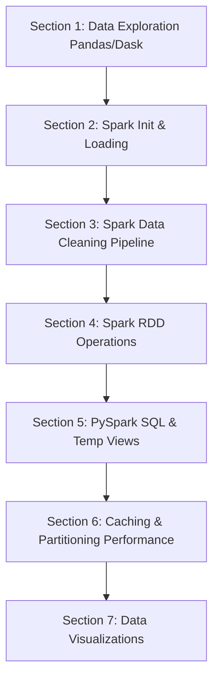

# 🚔 Spatio-Temporal Crime Analysis Pipeline

An end-to-end distributed data pipeline and analytical system for processing, cleaning, querying, and visualizing spatio-temporal crime patterns (using the Chicago Crime dataset). 

This project is built using a hybrid approach leveraging **Pandas** and **Dask** for initial local data exploration, alongside **Apache Spark (PySpark)** and **Spark SQL** for heavy-duty distributed processing and analysis.

---

## 🏗️ Project Architecture

The project has been refactored into a clean, modular structure following enterprise data engineering best practices:

```directory
├── .github/
│   └── workflows/
│       └── code_check.yml       # Automated Python syntax check CI engine
├── data/
│   └── README.md                 # Instructions to download the raw Chicago Crime dataset
├── notebooks/
│   └── Spatio_Temporal_Crime_Analysis.ipynb  # Interactive analysis notebook
├── src/
│   ├── spark_session.py         # Modular Spark session builder
│   └── data_cleaning.py         # Standardized PySpark cleanup procedures
├── .gitignore                   # Project gitignore file
├── requirements.txt             # Project library dependencies
```

### 🧩 Core Modules (`src/`)
- **`src/spark_session.py`**: Encapsulates Spark Session initialization logic and configurations to keep session creation consistent across environments.
- **`src/data_cleaning.py`**: Implements standardized cleanup procedures for PySpark DataFrames, including spatial column removal, missing values handling (using grouped mode calculations), and datetime feature extraction.

---

## 🗺️ Pipeline Roadmap & Sections

The analysis script `spatio_temporal_crime_analysis.ipyb`  is structured as a 7-stage data pipeline:



1. **Section 1: Data Exploration (Pandas & Dask)**: Explores data structures locally, calculates counts, and visualizes distribution using Pandas/Dask.
2. **Section 2: PySpark Initialization & Loading**: Initializes the Apache Spark engine and reads the raw dataset into a distributed PySpark DataFrame.
3. **Section 3: Standardized PySpark Data Cleaning**: Cleans datasets by removing coordinate features, calculating and filling missing values, and engineering temporal features (Year, Month, Hour, Day of Week).
4. **Section 4: PySpark RDD Operations**: Performs functional RDD transformations and actions (map, filter, reduce, aggregateByKey, and set operations).
5. **Section 5: PySpark SQL Queries & Spark SQL**: Utilizes Spark SQL views and Window specifications to query, rank, and aggregate crime patterns.
6. **Section 6: Caching, Persistence & Partitioning**: Performs benchmarks on Spark caching levels (MEMORY_ONLY vs MEMORY_AND_DISK), partitioning performance, and broadcast operations.
7. **Section 7: Data Visualizations**: Pulls aggregated analytical datasets into Pandas to plot Yearly trends, Crime Category bar charts, and Spatio-Temporal heatmaps.

---

## 🚀 Setup & Installation

### 1. Prerequisites
Ensure you have Python 3.10+ and Java (required by Apache Spark) installed on your local machine.

### 2. Install Dependencies
```bash
pip install -r requirements.txt
```

### 3. Dataset Setup
* **Out-of-the-Box Mode**: The project includes a lightweight sample dataset (`Crime_Data_from_2020_to_Present.csv`). If you do not have the full Kaggle dataset, the pipeline automatically detects this and falls back to running on the sample file.
* **Full Mode**: Download the dataset from Kaggle:
  [Chicago Crimes Dataset (2001-Present)](https://www.kaggle.com/datasets/adelanseur/crimes-2001-to-present-chicago).
  Place the downloaded `Crimes_-_2001_to_Present.csv` file inside the `data/` folder in the root directory.

### 4. Running the Pipeline
To execute the complete pipeline locally:
```bash
python spatio_temporal_crime_analysis.py
```

---

## 🧪 Automated CI Checks
A GitHub Actions workflow is located at `.github/workflows/code_check.yml`. On every `push` and `pull_request` to the main branches, the workflow will setup the Python environment, install libraries, and run a full compiler syntax check (`python -m compileall .`) across the entire repository to ensure code quality is maintained.
